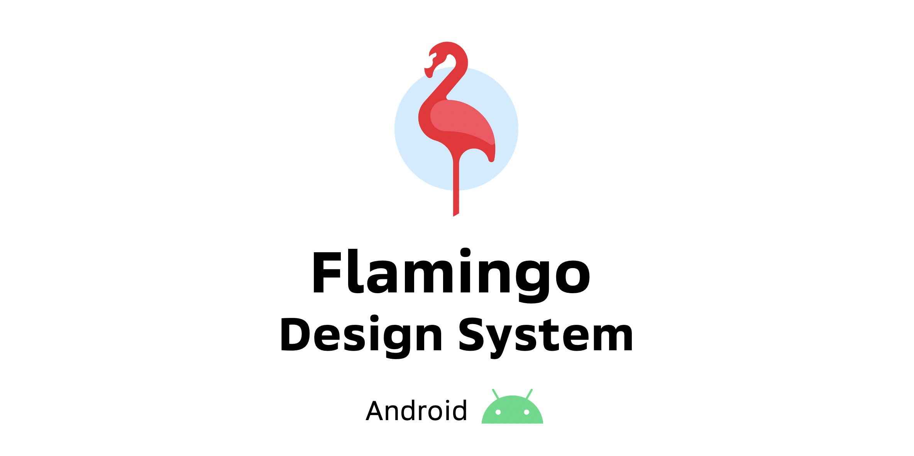

It is an Android implementation of the Flamingo Design System.

## It Consists Of:

1. Palette
2. Theme colors
3. Typography
4. Icon set
5. Illustrations
6. Gradients
7. __UI components__

# Playground App

Flamingo Playground is a demonstration app that contains __live__ (meaning generated using _real_
code) demos of various design system components
(see _[It consists of](https://github.com/flamingo-ux/flamingo-android#It-consists-of)_).

Here you can see a brief demonstration of the design system:
__[Youtube Videos](https://youtube.com/playlist?list=PLSzrfgGrhXFpKbRy-IA5Ju3sOpbFQa5ZX)__

__[Download](https://github.com/flamingo-ux/flamingo-android/releases)__ Flamingo Playground App

# Getting Started

1. Download `.aar`s of `flamingo` and `flamingo-roboto-font` modules from the 
   [releases](https://github.com/flamingo-ux/flamingo-android/releases) page
2. Put them in `/project name/libs/` folder
3. Add this to your module's `build.gradle(.kts)`:

    ```kotlin
    implementation(files("$rootDir/libs/flamingo-LATEST_VERSION.aar"))
    implementation(files("$rootDir/libs/flamingo-roboto-font-LATEST_VERSION.aar"))
    ```
4. Call `initRobotoTypography()` before the first call to the `FlamingoTheme`


<details><summary>If you are an internal user</summary>

Use _releases_ page in confluence and use `flamingo-sbsans-font` module instead

</details>

### Playground

Flamingo Playground is a demonstration app that contains __live__ (meaning generated using _real_
code) demos of various design system components
(see _[It consists of](https://github.com/flamingo-ux/flamingo-android#It-consists-of)_).

It can be downloaded separately [here](https://github.com/flamingo-ux/flamingo-android/releases).

In addition, playground contains various debugging developer tools that facilitate painless 
integration and further support of the design system in __your__ product.

To be able to use those, add the Flamingo Playground to your app:

1. Download `.aar` of `flamingo-playground` module from the 
   [releases](https://github.com/flamingo-ux/flamingo-android/releases) page
2. Put it in `/project name/libs/` folder
3. Add this line in your _staging_ module's `build.gradle.kts`:

    ```kotlin
    implementation(files("$rootDir/libs/flamingo-playground-LATEST_VERSION.aar"))
    ```

   <details><summary>If you are an internal user</summary>

   Use _releases_ page in confluence

   </details>

   If your project doesn't have a staging module, use
   [_build variants_](https://developer.android.com/studio/build/build-variants) (not recommended):

    <details><summary>Example</summary>

    ```kotlin
    android {
        // ...
        productFlavors {
            create("staging") {}
            create("production") {}
        }
    }
    
    dependencies {
        // ...
        stagingImplementation(files("$rootDir/libs/flamingo-playground-LATEST_VERSION.aar"))
    }
    ```

    <details><summary>Groovy</summary>

    ```groovy
    android {
        productFlavors {
            staging {}
            production {}
        }
    }
    
    dependencies {
        // ...
        stagingImplementation(files("$rootDir/libs/flamingo-playground-LATEST_VERSION.aar"))
    }
    ```

    </details>
    </details>

4. Add a button to your app's debug screen that launches `com.flamingo.playground.FlamingoPlaygroundActivity`.

# Modules Graph


