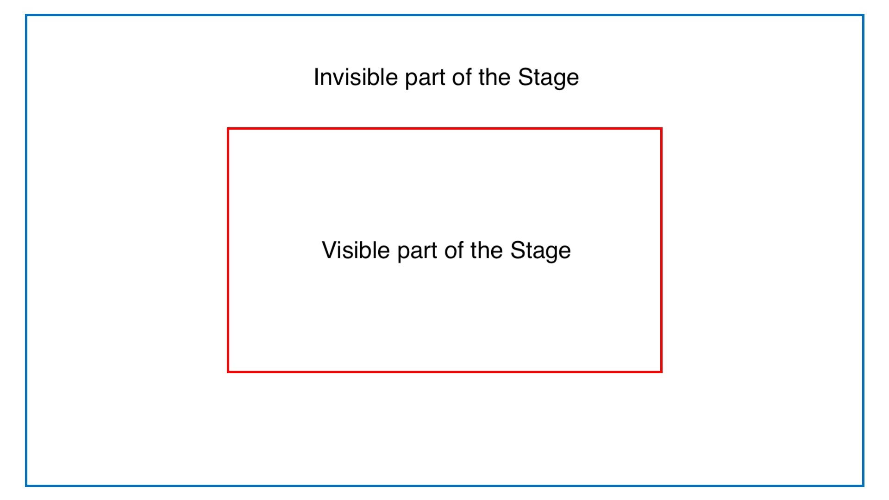

# 🎭 Theater

_Theater_ is a small framework for creating short 3D animation videos about UI components (Button, 
Alert, TopAppBar, Chip, etc.). It requires writing a __plot__ of the video in kotlin. Then video can
be viewed and rendered in realtime on an Android device.

## Examples
1. TODO
2. TODO

# How to create a video?
[Code](https://todo.com/) of the already written video plots is a good starting point to learn 
Theater.

## Integration into the Flamingo Design System's playground app
1. [Example integration in the app](https://todo.com/)
2. [Render vs play demo](https://todo.com/)

## How it works
Theater uses [animation API](https://developer.android.com/jetpack/compose/animation) and 
`graphicsLayer` API from Jetpack Compose.
Each of the parameters in the `graphicsLayer` modifier (rotation, scale, etc.) can be animated using 
keyframes, thus creating a basic plot.

## Main building blocks of the framework
1. __Stage__: A rectangle with a size specified in pixels whose content is the content
   of the video. In fact, there is an invisible part of the stage — it goes beyond the edges of the 
   screen. Its size is controlled by the setting 
   [`SizeConfig.stageSizeMultiplier`](https://todo.com/). E.g.:

   

   This is necessary in order to be able to:
    1. Place actors beyond the borders of the stage
    2. Place actors on stage with a size larger than the visible part of the stage (for example, a 
       long text to scroll)

2. __Actor__: Single entity that can be animated with graphicsLayer parameters (rotation, scale, 
   etc.). Each actor has 2 `graphicsLayer` _layers_ (`Knobs`): one nested within the other. It is 
   necessary to achieve more complex effects (slide a rotated actor in its plane).

2. __Lead Actor__: Main, default actor. It can be accessed using the shortcuts available in
   `PlotScope`.

2. __Cast__: List of actors.

3. __Plot__: a program written by the Theater user (Director) that performs actions on actors.

3. __Backstage__: 3D studio that helps to create keyframes for the plot using convenient Android UI.

3. __Knobs__: A class containing `graphicsLayer` variables wrapped in `Animatable` that can be
   animated in the plot.

## Fundamental limitations
1. translationZ can't be set (as in "_distance between 2 actors_")
2. "Fake" 3D space (if you rotate an object that contains an already rotated object,
   the internal object will look like a flat projection)
3. No reflections, curved surfaces, 3D objects (spheres, boxes, cubes, pyramids, etc.)

## Render
Rendering of videos is recommended to be done on real devices, not emulators — a lot
dropped frames and audio issues. You just need to start the screen recording and open the 
_Render Video_ screen.

## Naming
Terms from this [domain](https://www.vocabulary.com/lists/1510879) are an excellent fit for naming 
building blocks of the framework: play, stage, plot, actor, backstage, cast, etc.